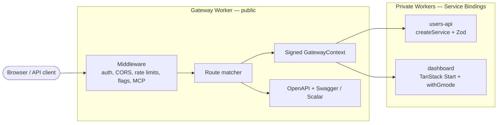

# GMode

TypeScript framework for building API platforms on Cloudflare Workers.

GMode keeps the public edge small: one **gateway** Worker receives traffic,
applies shared policy, signs internal context, and forwards to private
**service** and **web** Workers through Cloudflare Service Bindings. A
manifest-driven CLI scaffolds workspaces, syncs wrangler bindings, runs
orchestrated local dev, and ships typed clients.

## Start Here

| Audience | Start with |
|---|---|
| New app on Cloudflare | [`pnpm create gmode my-app`](./packages/create-gmode/README.md) |
| Framework internals | [Documentation index](./docs/README.md) |
| Gateway + service APIs | [Getting started](./docs/getting-started.md) |
| Workspace CLI | [Workspace CLI](./docs/workspace-cli.md) |
| Local verification | [Testing guide](./TESTING.md) |

## Quick Start

```bash
pnpm create gmode my-app
cd my-app
pnpm install
pnpm exec gmode new service users
pnpm dev
```

Open http://localhost:8787/docs for aggregated Swagger, http://localhost:9100
for the dev dashboard.

## Architecture



## Packages

| Package | Purpose |
|---|---|
| `@gmode/core` | Errors, HMAC signing, OpenAPI helpers, binding helpers, sequences, webhooks |
| `@gmode/gateway` | `createGateway()`, middleware, OpenAPI aggregation, forwarding |
| `@gmode/service` | `createService()` with Zod/Standard Schema, gateway-context trust |
| `@gmode/rpc` | Typed `WorkerEntrypoint` RPC between services |
| `@gmode/mcp` | MCP catalog/tools over aggregated OpenAPI |
| `@gmode/web` | `withGmode()` + `createWebApp()` for TanStack Start / Vite SPAs behind the gateway |
| `@gmode/client` | Typed fetch runtime used by generated clients |
| `@gmode/cli` | Workspace CLI (`gmode`) + Cloudflare API Shield commands |
| `@gmode/dashboard` | Prebuilt dev dashboard UI served by `gmode dev` |
| `@gmode/testing` | Mocks and test clients for Workers bindings |
| `create-gmode` | `pnpm create gmode` workspace scaffolder |

The CLI binary is `gmode` (from `@gmode/cli`).

## Examples

| Example | What it demonstrates |
|---|---|
| [gateway-basic](./examples/gateway-basic/README.md) | Gateway + users + billing, JWT, MCP, RPC |
| [web-app-tanstack](./examples/web-app-tanstack/README.md) | Full manifest workspace, TanStack Start, `gmode dev`, codegen |

## Common Workflows

| Goal | Go to |
|---|---|
| Scaffold a new workspace | [Workspace CLI](./docs/workspace-cli.md) |
| Build a gateway and service by hand | [Getting started](./docs/getting-started.md) |
| Configure bindings, secrets, cache | [Cloudflare configuration](./docs/cloudflare-configuration.md) |
| Auth, signing, private context | [Auth and security](./docs/auth-and-security.md) |
| Mount a TanStack / Vite web app | [Workspace CLI — web apps](./docs/workspace-cli.md#web-apps) |
| Generate a typed API client | [Workspace CLI — codegen](./docs/workspace-cli.md#codegen) |
| API Shield schema + sequences | [API Shield](./docs/api-shield.md) |
| Expose APIs to AI agents (MCP) | [MCP server](./docs/mcp.md) |
| Service-to-service RPC | [Service-to-service RPC](./docs/rpc.md) |
| Run tests locally | [Testing guide](./TESTING.md) |
| Publish to npm | [Release process](./docs/release.md) |

## Monorepo Commands

```bash
pnpm install
pnpm typecheck
pnpm lint
pnpm test              # unit + integration (no live wrangler)
pnpm test:e2e:smoke    # live wrangler / gmode dev (~80s)
pnpm build
pnpm changeset
```

## Status

The gateway/service runtime, workspace CLI, web-app mounting, dev dashboard,
typed client codegen, MCP, RPC, and API Shield CLI are implemented with unit,
integration, and E2E smoke coverage. Packages are versioned with Changesets;
the first public npm release is tracked in [docs/reference.md](./docs/reference.md).
