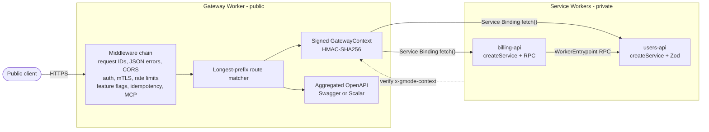

# GMode

TypeScript framework for building focused API platforms on Cloudflare Workers.

GMode keeps the public edge small: one Gateway Worker receives traffic, applies
shared policy, signs internal context, and forwards to private Service Workers
through Cloudflare Service Bindings.

The scope is intentionally narrow: GMode keeps the gateway/service runtime and
does not carry over generated services, public clients, runtime-loaded workers,
Worker Loader, or end-user code execution paths.

## Start Here

- [Documentation index](./docs/README.md)
- [Getting started](./docs/getting-started.md)
- [Cloudflare configuration](./docs/cloudflare-configuration.md)
- [Testing guide](./TESTING.md)

## Architecture



## Packages

- `@gmode/core` - shared primitives: errors, response helpers, HMAC signing, OpenAPI helpers, Cloudflare binding helpers, sequence policy declarations, redaction, and webhooks.
- `@gmode/gateway` - `createGateway()` plus middleware for auth, CORS, request IDs, logging, Cloudflare Rate Limiting, Flagship, mTLS, API Shield session IDs, idempotency, OpenAPI aggregation, docs, and forwarding.
- `@gmode/service` - `createService()` with Zod or Standard Schema validation, signed gateway-context verification, route-level authorization, feature flags, sensitive-field tagging, and internal OpenAPI emission.
- `@gmode/rpc` - typed service-to-service RPC over `WorkerEntrypoint`.
- `@gmode/mcp` - exposes aggregated API operations as MCP catalog or operation tools.
- `@gmode/cli` - Cloudflare API Shield commands for schema upload, discovery diffing, schema actions, and sequence exports.
- `@gmode/testing` - mocks and test clients for Workers bindings and GMode primitives.

The CLI package is published as `@gmode/cli`; its command binary is `gmode`.

## Common Workflows

| Goal | Go to |
|---|---|
| Build a gateway and service | [Getting started](./docs/getting-started.md) |
| Configure Service Bindings, secrets, cache, observability, rate limits, KV | [Cloudflare configuration](./docs/cloudflare-configuration.md) |
| Resolve and test D1, R2, Queue, and KV bindings | [Cloudflare binding helpers](./docs/cloudflare-binding-helpers.md) |
| Add JWT, API keys, mTLS, signed context | [Auth and security](./docs/auth-and-security.md) |
| Add retry-safe writes | [Idempotency](./docs/idempotency.md) |
| Add globally coordinated rate limits | [Durable Object rate limiting](./docs/durable-object-rate-limiting.md) |
| Add Cloudflare Flagship feature flags | [Feature flags](./docs/feature-flags.md) |
| Add gateway-owned Workers Cache policy | [Workers Cache](./docs/workers-cache.md) |
| Use OpenFeature-style flag evaluation | [OpenFeature](./docs/openfeature.md) |
| Export request telemetry | [Telemetry](./docs/telemetry.md) |
| Run `/v1` and `/v2` side by side | [API versioning](./docs/api-versioning.md) |
| Choose Swagger UI or Scalar docs | [API docs UI](./docs/api-docs-ui.md) |
| Send signed webhooks | [Webhooks](./docs/webhooks.md) |
| Use API Shield schema validation, JWT, mTLS, sequences | [API Shield](./docs/api-shield.md) |
| Call services with typed RPC | [Service-to-service RPC](./docs/rpc.md) |
| Version and publish packages | [Release process](./docs/release.md) |
| Expose the API to AI agents via MCP | [MCP server](./docs/mcp.md) |
| Understand runtime contracts and roadmap | [Reference](./docs/reference.md) |

## Quick Commands

```bash
pnpm install
pnpm typecheck
pnpm test
pnpm build
pnpm changeset
```

## Status

The focused gateway/service path, RPC path, MCP path, Cloudflare binding
helpers, and Cloudflare API Shield CLI path are implemented and covered by
local tests. Releases are versioned with Changesets and published by the
GitHub release workflow.
